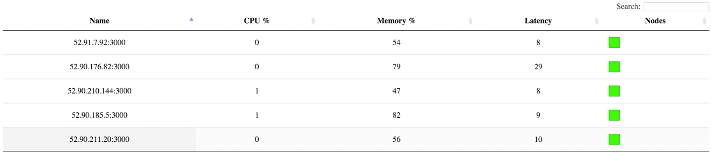

#M4 SPECIAL - Gift Monkey & Doctor Monkey

In this special milestone, we implement gift monkey and doctor monkey. This project is built on top of milestone 3. Our apps are deployed on AWS.

Our project is mainly consisted of following components.

## Redis
The redis server is used to:

* Control feature flags
* Maintain a server list
	* A monitor program keeps an eye on every servers in this list
	* When a new server instance is created using gift monkey, it will be added to server list automatically
	* When a server needs reboot (doctor monkey), it will be removed from the list untill it gets on line

## Monitor
A monitor program tracking the cpu usage, memory usage and latency of each server.

If the average cpu usage is too high, it will trigger gift monkey.

If the cpu usage of a single server is too high, it will trigger the doctor monkey.

## Proxy

## Gift Monkey
When average cpu usage of servers > 70%, gift monkey will be trigger to launch a new server instance. This task can be divided into following two parts:

* Add the new server instance to server list stored in redis
* Automatically add routes to new server

You can watch the demo [here](https://drive.google.com/a/ncsu.edu/file/d/0B87f7178bIHnNnlNZkMzdzNYVlk/view?ts=5664f3c4).

## Doctor Monkey
When cpu usage of a single server > 90%, the doctor monkey will be triggered to reboot the server.

* Before rebooting, the server is removed from the server list and corresponding routing is deleted
* After rebooting, add the server to server list and proxy server rebuild the routing

You can watch the demo [here](https://drive.google.com/a/ncsu.edu/file/d/0B87f7178bIHnU3JLckd3Z2k1dVk/view?ts=5664f3d1).
