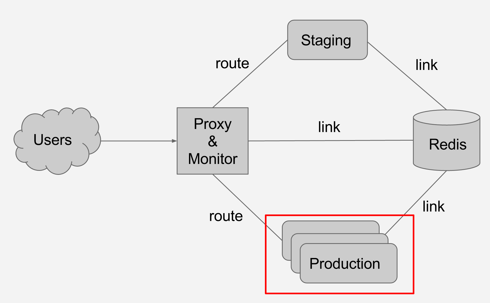
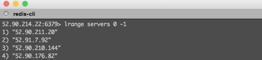
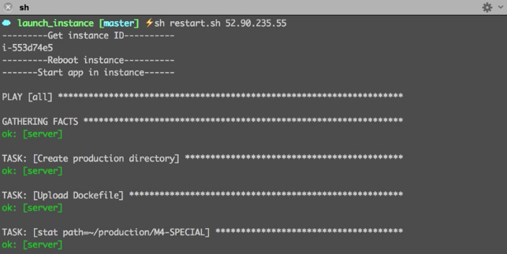

#M4 SPECIAL - Gift Monkey & Doctor Monkey

In this special milestone, we implement gift monkey and doctor monkey. This project is built on top of milestone 3. Our apps are deployed on AWS.

This is a [demo](https://www.youtube.com/watch?v=TaDe8kV6neI&feature=youtu.be) of our whole pipeline, the introduction of our Milestone 4 starts at 3'30''

Our project is mainly consisted of following components.

## Structure
Based on structure we used in the Milestone 3, we add some additional servers in the Production side to share the workload. 

The gift monkey and doctor monkey we implemented in this milestone are designed to auto scale up the production server or auto restart a server 
when some certain conditions satisfied. 


## Key components
### Redis
The redis server is used to:

* Control feature flags
* Maintain a server list

	
	* Proxy will route traffic to every IP address in the server list
	* When a new server instance is created using gift monkey, it will be added to server list automatically
	* When a server needs reboot (doctor monkey), it will be removed from the list untill it gets on line
* Communicate between Monitor App and productions. There is a small monitor program in each production server, it will write its current CPU usage and memory usage data in to the global Redis server, then the Monitor App will consume data for it. 

### Proxy & Monitor
The proxy routes the traffic to the servers in the server list. We can stop routing traffic to a certain server by removing that server's IP from Redis. Or add a new server's IP to the server list to route some traffic to it.

The monitor program tracking the cpu usage, memory usage and latency of each server.


If the average cpu usage is too high, it will trigger gift monkey.

If the cpu usage of a single server is too high, it will trigger the doctor monkey.


### Gift Monkey
When average cpu usage of servers > 70%, gift monkey will be trigger to launch a new server instance. This task can be divided into following parts:

* Launch a new instance in AWS
* Config the instance and deploy production app to that instance
* Automatically add the new instance's IP to the server list in Redis.

The code is in `launch.sh`.
```
#!/bin/bash
nodejs launch_instance.js
sleep 60
ansible-playbook -i inventory provision.yml
ansible-playbook -i inventory production.yml
```

### Doctor Monkey
When cpu usage of a single server > 90%, the doctor monkey will be triggered to reboot the server.

* Before rebooting, the server is removed from the server list and corresponding routing is deleted
* Reboot the server, and start the production app in the server when finish rebooting.
* After rebooting, add the server to server list and proxy server rebuild the routing.

The code is in `restart.sh`
```
echo "---------Get instance ID----------"
aws ec2 describe-instances > instances.json
id=$(nodejs restart.js $1)
echo $id
echo "---------Reboot instance----------"
aws ec2 reboot-instances --instance-ids $id
sleep 120

echo "-------Start app in instance------"
echo "server ansible_ssh_host=$1 ansible_ssh_user=ubuntu ansible_ssh_private_key_file=private.key" > inventory
ansible-playbook -i inventory production.yml
```



